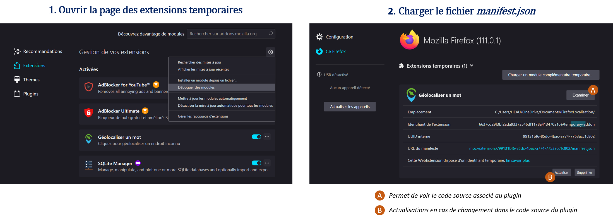

# Rapport sur le module complémentaire Firefox "FirefoxLocalisation"
Vincent Heau
29 mars 2023

## Introduction
Le module complémentaire "FirefoxLocalisation" permet d'ouvrir un panneau latéral avec une carte. Lorsque l'on clique sur un mot d'un article, un service de géocodage est appelé pour afficher le résultat sur la carte. On l'utilise pour trouver un endroit inconnu d'un article du Monde par exemple.

## 1. Comment fonctionne une extension Firefox
### 1.1 Description des fichiers
Une extension Firefox est composée de plusieurs fichiers :
- Le fichier `manifest.json`, qui contient les informations sur l'extension (nom, version, icône, etc.) et les fichiers qui la composent.
- Les fichiers HTML, CSS et JavaScript qui constituent l'interface utilisateur de l'extension.
- Le fichier `background.js`, qui contient le code JavaScript qui s'exécute en arrière-plan de l'extension.

Dans le cadre de ce projet, l'affichage d'une carte dans la page a orienté le développement vers un panneau latéral (en anglais "sidepar") qui s'affiche lorsque module est activé et que l'utilisateur décide de géolocaliser un mot. 
Le code suivant dans le fichier `manifest.json`permet aussi faire apparaître le panneau avec la commande **Ctrl+Shift+Y**
```javascript
"commands": {
    "_execute_sidebar_action": {
      "suggested_key": {
        "default": "Ctrl+Shift+Y"
      }
    }
  }
```
Ce panneau latéral est codé comme une page html, css et javascript dans le dossier `sidebar` du code.


### 1.2 Ambivalence des fichiers background.js et panel.js
Le fichier `background.js` est le fichier principal de l'extension. Il est chargé lorsque l'utilisateur installe l'extension et s'exécute en arrière-plan de Firefox. Il permet d'interagir avec le navigateur, d'écouter les événements (clics, chargement de page, etc.) et de communiquer avec les autres fichiers de l'extension. Dans le cas précis de cette extension, il sert uniquement au chargement du panneau lorsque le droit *Géolocaliser un mot* est effectué.

## 2. Présentation de l'extension
### 2.1 Installation et fonctionnement
L'extension "FirefoxLocalisation" permet d'ouvrir un panneau latéral avec une carte. Lorsque l'on clique sur un mot d'un article, les différents services de géocodage sont appelés pour afficher le résultat sur la carte.
Voici en image les différents étapes pour installer et se servir du plugin:

- Clonez le répertoire GitHub ou téléchargez le dossier et placez-le dans votre répertoire courant.
- Ouvrir Firefox > Extensions > Débobuer des modules > Charger un module complémentaire temporaire


Une fois le module chargé, un panneau latéral apparaît alors sur la page. Celui-ci peut être fermé si besoin. Une fois sur un article du monde, un clic droit sur un mot permet de faire fonctionner le plugin.


### 2.2 Géocodage
Le géocodage est le processus de transformation d'une adresse ou d'un nom de lieu en coordonnées géographiques (latitude et longitude). Dans le cas de l'extension "OpenMap", les différents services de géocodage (tels que Google Maps, OpenStreetMap, etc.) sont appelés lorsque l'utilisateur clique sur un mot d'un article. Le résultat est ensuite affiché sur la carte dans le panneau latéral. Le plugin actuel ne fonctionne qu'avec le géocodage PTVGroup, les autres services étant payants.
> ℹ️ Remarque : On peut retrouver le code des différents géocodage dans le [README.md](./README.md).

### 2.3 Récupération du mot sélectionné dans l'url
Lorsque l'on clique, sur un  mot à géolocaliser, le fichier `background.js` se lance. Il faut réussir à "faire passer" le mot sélectionner vers le fichier `panel.js` qui gère le géocodage et la construction de la carte. En effet, on ne pas tout faire dans `background.js` car ce dernier n'est associé à aucune page html.

Pour ce faire, j'ai effectué la manipulation suivante :
Dans le fichier `background.js`, on peut utiliser la méthode browser.sidebarAction.setPanel() pour ouvrir la sidebar et passer des paramètres dans l'URL de la sidebar à l'aide du code suivant :
```javascript
// Récupérer le texte sélectionné
var selectionText = "";
browser.tabs.executeScript({code: "window.getSelection().toString();"}).then((result) => {
  selectionText = result[0];
  
  // Stocker le texte sélectionné à passer en paramètre
  var data = {
    selection: selectionText
  };
  browser.storage.local.set({data: data});
  
  // Ouvrir la sidebar et passer les données en paramètre
  browser.sidebarAction.setPanel({panel: "sidebar/panel.html?data=" + encodeURIComponent(JSON.stringify(data))});
});

```
Dans ce code, la méthode executeScript() de l'API browser.tabs permet d'exécuter du code JavaScript dans le contexte de la page active. Ensuite, le code window.getSelection().toString() permet de récupérer le texte sélectionné et de stocker le résultat dans une variable selectionText.

Ensuite, le texte sélectionné est passé dans un objet data avec la méthode set() de l'API browser.storage.local en utilisant la clé "data".

Enfin, c'est avec setPanel() de l'API browser.sidebarAction qu'il est possible d'ouvrir la sidebar et de passer les données en paramètre. Les données passent sous forme de chaîne de requête dans l'URL de la sidebar en utilisant la méthode encodeURIComponent() pour éviter les erreurs de formatage.


Dans le fichier panel.js associé à la sidebar, on récupère les données ainsi avec URLSearchParams
```javascript
// Récupérer les données passées en paramètre
var urlParams = new URLSearchParams(window.location.search);
var myData = JSON.parse(decodeURIComponent(urlParams.get("data")));

```
Avec un bloc try/catch, on peut aussi éviter les erreurs lorsque aucun mot n'est placé dans l'URL.

### 2.4 Améliorations possibles
Bien que l'extension fonctionne bien dans son ensemble, il reste possible d'apporter des améliorations. Par exemple, on pourrait ajouter une fonctionnalité de recherche pour permettre à l'utilisateur de chercher un lieu directement depuis le panneau latéral. On pourrait également ajouter des options pour personnaliser l'apparence de la carte ou pour choisir le service de géocodage à utiliser.

## 3. Ressources et éléments produits
### 3.1 Vidéo d'installation
Afin de faciliter l'installation de l'extension, nous avons créé une vidéo explicative qui montre les étapes à suivre pour installer et utiliser l'extension. Cette vidéo est disponible sur YouTube à l'adresse suivante : [lien vers la vidéo](https://www.youtube.com/watch?v=XXXXXXXXXXX).

### 3.2 Readme.md
Nous avons également créé un fichier `README.md` qui contient des informations détaillées sur l'extension, les fonctionnalités qu'elle propose, les raccourcis clavier disponibles, etc. Ce fichier est disponible sur GitHub à l'adresse suivante : [lien vers le fichier README.md](./README.md).


